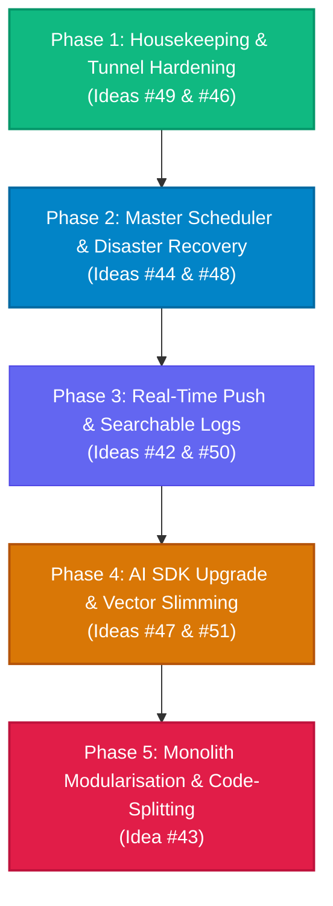

# System Architecture Implementation Plan: Modernisation & Reliability

## Executive Overview

This plan outlines the systematic modernisation and hardening of the **Information Management System (IMS)** backend, data layer, and web client. It addresses all **9 outstanding architectural developer ideas** recorded in the IMS Dev Ideas service.

To ensure continuous system availability—particularly for critical real-time features like continuous glucose monitoring (CGM), hardware voice interactions (ESP32-S3-BOX-3), and daily briefing generation—the work is sequenced across **5 distinct, dependency-aware phases**.

---

## The 5 Implementation Phases

### Phase 1: Spring Clean & Locking the Front Doors
*Addressing Dev Idea #49 (Housekeeping) and Dev Idea #46 (Security Hardening)*

#### What It Means in Plain English
Think of this as tidying up the workshop bench so you don't trip over old testing scraps, while putting proper deadbolts and parcel weight limits on the front door so nobody can drop a massive 50 MB boulder through the letterbox.

#### Technical Scope
1. **Repository Hygiene (#49):**
   - Move non-essential diagnostic scripts (`check_cols.js`, `check_db.js`, `check_schema.js`, `check_settings.js`, `check_token.js`, `scratch_check_db.js`, `scratch_test_drive.js`, `test_attachment_extraction.js`, `test_endpoint.js`) into `pdf-knowledge-base/server/scripts/`.
   - Purge dead crash artifacts (`bash.exe.stackdump`), empty placeholder SQLite files (`db/database.sqlite`, `db/library.db`), and Office temporary locks (`~$*`).
   - Extend `.gitignore` to prevent scratch files from polluting source control.
2. **Tunnel & Access Hardening (#46):**
   - Enable Express `trust proxy: 1` in `server/index.js` to accurately inspect client IP addresses forwarded by `ngrok` or `cloudflared`.
   - Set session cookie security policies: enforce `sameSite: 'lax'` and conditionally set `secure: true` whenever requests arrive over HTTPS.
   - Restrict the global JSON body parser from `50mb` down to `1mb` standard payload limits, granting `50mb` exemptions only to specific document and photo upload routers (`/api/pdf`, `/api/carbs/photo`, `/api/rulebook`).
   - Integrate Helmet middleware with Content Security Policy (CSP) tailored to allow OpenStreetMap map tiles, Google Web Fonts, and local WebSocket connections.

#### Trade-Offs & Stability Risks
* **Pros:** Closes remote denial-of-service vulnerabilities, protects session cookies from sniffing over public Wi-Fi, and eliminates cognitive clutter in the codebase.
* **Cons:** Requires explicit CSP declarations for third-party CDNs and mapping assets.
* **Stability Risk:** **Low–Moderate.** If CSP rules are too rigid, map tiles or audio streaming sockets could be blocked. 
* **Rollback Plan:** Immediate reversion of Helmet CSP config; fast toggle back to default body parser limits.

---

### Phase 2: One Master Timetable & a Tested "Panic Button"
*Addressing Dev Idea #44 (Central Job Scheduler) and Dev Idea #48 (Backup Drills & Restore)*

#### What It Means in Plain English
Replacing 18 separate kitchen egg timers with one smart master clock on the wall, and actually testing your fire escape door once a week to prove it opens smoothly instead of just crossing your fingers.

#### Technical Scope
1. **Central Job Scheduler (#44):**
   - Construct `pdf-knowledge-base/server/services/schedulerService.js` to replace 18 fragmented `setInterval` loops across `index.js`, `glucoseHubService`, `stravaService`, `calendarService`, `weatherService`, and `morningReportService`.
   - Enforce British London wall-clock scheduling (`Europe/London`).
   - Introduce concurrency run-locks per task to prevent overlapping execution of long-running operations (e.g., Strava synchronization or morning report pre-warming).
   - Track `lastRun`, `nextRun`, `durationMs`, and `lastError` metadata, exposing `GET /api/jobs` to power a new **Background Jobs** telemetry card in `/ims/architecture`.
2. **Automated Backup Drills & One-Click Restore (#48):**
   - Build a weekly background drill in `backupService.js` that unzips the latest archive into a temporary sandbox and executes SQLite `PRAGMA integrity_check`, publishing status badges to the Backups portal.
   - Implement an authenticated **Restore** endpoint (`POST /api/backups/restore/:filename`) that pauses background jobs, creates a pre-restore safety snapshot of the active `app.db`, replaces database and asset files, and gracefully reboots.
   - Add a separate secure backup mechanism for `data/.wifi_key` so hardware credentials survive restorations.

#### Trade-Offs & Stability Risks
* **Pros:** Prevents simultaneous background tasks from locking the SQLite database; guarantees backup archives are uncorrupted and recoverable without command-line intervention.
* **Cons:** Requires centralising 18 diverse job contracts with different retry behaviours.
* **Stability Risk:** **Moderate–High.** If a scheduled job crashes unhandled within the scheduler loop, background syncs could stall. An improperly managed database restore could corrupt live data.
* **Rollback Plan:** Individual job execution wrapped in defensive `try/catch` sandboxes with watchdog alarms; restore protocol mandates an automatic pre-restore backup snapshot before touching any live file.

---

### Phase 3: Instant Live Updates & Searchable Logbook
*Addressing Dev Idea #42 (Unified Server Push Stream) and Dev Idea #50 (Structured Levelled Logging)*

#### What It Means in Plain English
Instead of your web browser repeatedly tapping the server on the shoulder every 10 seconds asking *"Did the doorbell ring? Got new glucose? Finished that task?"*, the server simply whispers updates to your screen the split second they happen.

#### Technical Scope
1. **Server-Sent Events (SSE) Push Pipeline (#42):**
   - Establish `pdf-knowledge-base/server/services/eventBus.js` and an SSE endpoint at `GET /api/events`.
   - Broadcast events in real time: `glucose:update`, `doorbell:ding`, `device:status`, `job:complete`, `tasks:update`, and `music:scan_progress`.
   - Equip `/api/events` with 20-second keep-alive heartbeats (`: ping\n\n`) to prevent tunnel timeouts.
   - Introduce a React hook `useSystemEvents(topic, handler)` across client portals, eliminating client-side `setInterval` fetch loops.
2. **Structured Logging & Architecture Logs Explorer (#50):**
   - Introduce a structured logger (`pino`) with service tags (`[Weather]`, `[MorningReport]`, `[HardwareProxy]`) and levelled filters (`trace`, `debug`, `info`, `warn`, `error`).
   - Configure asynchronous log rotation in `data/logs/` capped at 14 days.
   - Quieten repetitive HTTP poll logging and add an interactive **Logs Explorer** tab inside `/ims/architecture` supporting full-text search, level filters, and direct links to trace IDs.

#### Trade-Offs & Stability Risks
* **Pros:** Reduces client-server HTTP network chatter by >80%; delivers instant UI feedback (zero delay on doorbell rings or glucose alarms); provides instant diagnostic traceability for bugs.
* **Cons:** Requires SSE connection reconnection logic on mobile devices when waking from sleep.
* **Stability Risk:** **Low–Moderate.** Memory leaks if client components fail to unbind SSE listeners upon unmounting.
* **Rollback Plan:** Client hook includes an automatic fallback to standard periodic polling if the SSE stream encounters persistent connection failures.

---

### Phase 4: Upgrading the AI Brain & Shrinking the Library
*Addressing Dev Idea #47 (Google Gen AI SDK Migration) and Dev Idea #51 (Knowledge Base Storage Optimization)*

#### What It Means in Plain English
Updating your AI subscription to Google's brand-new software engine, while digitising and compressing an overflowing filing cabinet so it takes up a fraction of the room without losing any detail.

#### Technical Scope
1. **Google Gen AI SDK Upgrade (#47):**
   - Upgrade from deprecated `@google/generative-ai` (^0.21.0) to Google's official unified `@google/genai` library.
   - Eliminate hardcoded, obsolete model strings (retiring `gemini-1.5-flash` references in `chatService.js`).
   - Centralise all model definitions in `config.js` (`gemini-2.5-flash`, `gemini-2.5-pro`, `gemini-3.8-live`, `text-embedding-004`, `imagen-3.0`) and synchronise them with the Model Switcher and System Architecture diagram.
2. **Storage Slimming & Vector Quantisation (#51):**
   - Implement SHA-256 content deduplication for PDF uploads in `data/pdfs/` (4.3 GB), preventing duplicate copies across different subject taxonomies.
   - Convert high-dimensional float32 vector embeddings in `data/vectors/` (1.9 GB) to int8 or float16 scalar quantisation, shrinking memory and disk consumption by 50% to 75%.
   - Implement incremental node updates in `hnswlib` (`indexDocumentIncremental()`) to remove the need for slow, full-index rebuilds on new uploads.
   - Add storage utilisation breakdowns per subject to the Admin panel.

#### Trade-Offs & Stability Risks
* **Pros:** Future-proofs IMS against Google API deprecations; reclaims 3–4 GB of disk space; accelerates document ingestion and reduces RAM usage.
* **Cons:** Quantisation introduces a microscopic (<1%) trade-off in mathematical retrieval precision.
* **Stability Risk:** **Moderate–High.** Gemini powers critical workflows: Day Report generation, RAG document search, Photo Carbs nutritional breakdown, and the voice fallback tool. Any interface discrepancy will cause AI failures. Vector corruption could break document search.
* **Rollback Plan:** Keep float32 vector backups alongside quantised files during testing; retain fallback wrapper matching `@google/generative-ai` response shapes until regression verification passes.

---

### Phase 5: Breaking Down the Two Giant "Do-Everything" Files
*Addressing Dev Idea #43 (Monolith Decomposition)*

#### What It Means in Plain English
Taking two 2,500-page telephone directories that have everything crammed into them and neatly splitting them into individual, well-organised booklets.

#### Technical Scope
1. **Deconstruct Server Monolith (`server/index.js` — 2,690 lines):**
   - Extract the Gemini Live WebSocket proxy into `server/services/geminiLiveProxy.js`.
   - Extract the Box-3 TCP audio bridge and framing logic into `server/services/box3HardwareBridge.js`.
   - Delegate Express route registration to modular routers under `server/routes/`.
2. **Deconstruct Web Client Monolith (`src/App.jsx` — 2,459 lines):**
   - Replace manual `switch/case` portal rendering with a declarative Route Table (`src/routes.js`).
   - Implement asynchronous code-splitting using `React.lazy()` and `Suspense` for all 29 portal views.
   - Resolve Vite's `>500 kB` bundle warning (currently bundling a 3.94 MB JavaScript blob).

#### Trade-Offs & Stability Risks
* **Pros:** Speeds up initial browser page load times; eliminates merge conflicts; makes future pair-programming and AI code generation significantly safer and faster.
* **Cons:** High refactoring surface area requiring touchpoints across every portal in the application.
* **Stability Risk:** **Very High.** High blast radius. Risk of broken route parameters, missed WebSocket lifecycle listeners, or missing context providers.
* **Rollback Plan:** Executed only after Phases 1–4 are complete and proven stable. Staged on an isolated branch with automated regression tests before merging.

---

## Complete Dev Ideas Cross-Reference

| Dev Idea ID | Category | Summary Description | Assigned Phase |
|---|---|---|---|
| **#49** | Housekeeping | Tidy root scripts, remove stale databases, extend `.gitignore` | **Phase 1** |
| **#46** | Security | Harden tunnel access, secure cookies, trust proxy, body limits, Helmet CSP | **Phase 1** |
| **#44** | Reliability | Central job scheduler, London time sync, concurrency locks, jobs panel | **Phase 2** |
| **#48** | Reliability | One-click backup restore, weekly integrity drill, separate Wi-Fi key export | **Phase 2** |
| **#50** | Observability | Structured levelled logging (Pino), log rotation, Architecture Logs tab | **Phase 3** |
| **#42** | Performance | Single `/api/events` SSE push stream to eliminate browser polling | **Phase 3** |
| **#47** | Reliability | Upgrade to `@google/genai` SDK, centralise model constants in `config.js` | **Phase 4** |
| **#51** | Storage/Perf | PDF deduplication, int8 vector quantisation, incremental HNSW indexing | **Phase 4** |
| **#43** | Maintainability | Split `server/index.js` and `App.jsx`, implement `React.lazy` code splitting | **Phase 5** |

---

## Recommended Execution Step

We recommend initiating **Phase 1 (Dev Ideas #49 & #46)** immediately:
1. It cleans the workspace of clutter and strengthens external tunnel security.
2. It carries virtually zero operational risk to active diabetes monitoring, voice streaming, or day report services.
3. It creates a clean, predictable baseline for the subsequent scheduler and logging enhancements.
