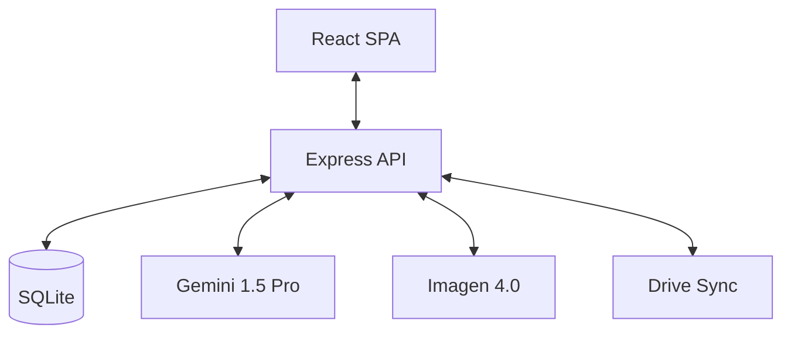

# Architecture Manual: Knowledge Base

## Executive Summary
Knowledge Base is a research-centric application designed to bridge the gap between static PDF data and dynamic AI exploration. It employs a "Design-First" architecture where the UI parity is enforced via a central JSON registry, and the backend is modularized into specialized AI services.

## 1. System Boundaries
The system is composed of a **Vite/React SPA** frontend and a **Node.js/Express** backend, persisting data in an embedded **SQLite** database.

## 2. Core Architectural Decisions

### 2.1 Centralized Design Tokens
To ensure absolute parity between the main application and the Admin Portal simulations, the project uses `src/ComponentStyleRules.JSON`. This file contains the "truth" for all padding, radius, and color tokens. Previews in the Admin Portal consume these tokens dynamically to prevent design drift.

### 2.2 Hook-Driven State Orchestration
The client utilizes a monolithic-logic hook (`useAppLogic`) to manage the complex interplay between chat states, voice engines, canvas content, and administrative tools. This promotes a "Single Source of Truth" for the application state.

### 2.3 Modular AI Services
The backend is partitioned into discrete services:
- `chatService.js`: Manages RAG context and Gemini interactions.
- `imageService.js`: Orchestrates Imagen 4.0 generation.
- `categorisationService.js`: AI-driven library organization.

## 3. Data Flow

### 3.1 PDF Indexing
1. **Sync**: User triggers a Google Drive sync.
2. **Extraction**: `pdfService` extracts text and metadata.
3. **Categorization**: `categorisationService` assigns subjects.
4. **Persistence**: Metadata is stored in SQLite; vector embeddings are generated for semantic search.

### 3.2 Conversational Research
1. **Input**: User sends a prompt (Text or Voice).
2. **Context Retrieval**: System fetches relevant PDF snippets.
3. **Generation**: Gemini generates a response with citation mappings.
4. **Feedback**: Response is streamed to the UI and optionally read aloud via `voiceEngine`.

## 4. Design System (Oatmeal)
The "Oatmeal" theme is defined by:
- **Primary Palette**: Ivory (#F1EFE9), Sage Green (#899981).
- **Aesthetics**: Glassmorphism (blur/translucency), Fluid Typography.
- **Rules**: Strictly documented in `ComponentStyleRules.JSON`.

## 5. Security Model
- **Authentication**: Gated by Google OAuth 2.0.
- **Authorization**: Hardcoded admin whitelist check in `admin.js` middleware.
- **Secrets**: Managed via environment variables; never committed.

---
> [!NOTE]
> This document is maintained by the **Docs Architect** and should be updated whenever significant architectural shifts occur.
